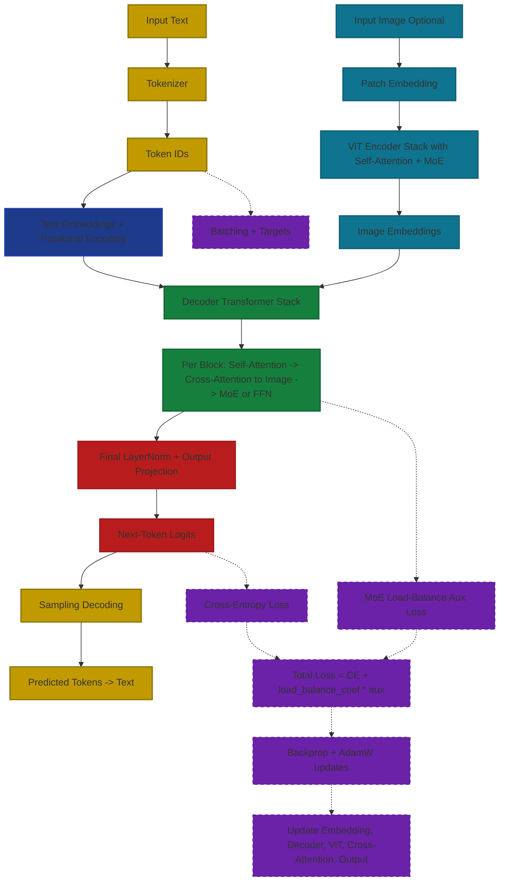

<p align="center">
  
  
  
  
</p>


# νοῦς (nous) — A Learning LLM Project

<div style="position: relative; width: 100%; height: 600px; margin: 40px 0;">
  
  
</div>

## Overview
νοῦς (nous, Greek for "mind/intellect") is a GPT-like LLM that uses a plethora of sources that are visible in the dataset loader.

But what **makes this different?**

Well, up to date, I haven't yet found a model for which I can customize literally anything with ease. Every GitHub repo that I've seen requires you to go into the depths of the model to look for `num_heads` or `embedding_dim` and read the entire readme file.

My point is that this app, Nous, allows you to do exactly that: configure literally any part of the model with ease through an Electron app. This means that you can use:
- Custom datasets
- Custom tokenizers (I have a BPE Tokenizer class that you can use, but it's kinda slow, so I also use TikToken)
- Custom number of attention heads, stacks, embedding dimension, max sequence length, epochs, batch size, learning rate, warmup steps
- Basically anything you can think of you can change (except for the FFN Hidden layer, that's hardcoded to `4*embedding_dim`)

**Example outputs for the current model (details below):**
```
Prompt: Explain what NLP is
Output: NLP is a type of artificial intelligence that enables computer systems to learn from data. It enables steps such as analyzing, understanding and comprehend, by describes the idea behind it and identify a specific topic about computers. It can also be used for natural language processing, machine translation and text summarization, such as voice assistants orPT-rich dialogue tools. Additionally, Machine learning algorithms can optimize processes in real-time, and provide insights into customer behavior.

Prompt: Can you please explain to me what photosynthesis is?
Output: Photosynthesis is the process by which plants, algae, and some bacteria convert sunlight, water, and carbon dioxide into energy in a series of replication. This process has various applications and it serves as a primary energy source of energy for plants and other organisms; it also converts carbon dioxide into glucose through a process known as oxygen.
```

## Quickstart
Download the Nous app (.dmg file) from the releases page and follow the onscreen instructions. Then, you may explore the app as you wish.

**Demo Video:**

https://github.com/Albertlungu/Nous/raw/refs/heads/JAX/concepts/assets/nous-demo.mov

A few notes:
1. The chat tab is for chatting with the current model. You can change generation settings in the top right corner by clicking on the gear icon.
2. Before sending a message, you must load a model by going to the models page.
3. You can also make dataset and training changes with the remaining pages.

>[!NOTE]
> If you see some errors in the console (text in red), just quit the app with CMD+Q then reopen it. This usually fixes the issues.
> Don't worry about error (400 BAD REQUEST), that won't go away, it still works.

Some example prompts you can give it to see exactly how intelligent it is:
> Explain what a neural network is.
>
> Explain what photosynthesis is.


## Installation and Setup (MacOS METAL)
This program requires the use of older Python releases, most notably 3.10.x. To complete your environment setup:
```bash
clone https://github.com/Albertlungu/Nous.git
cd Nous
./metal_setup.sh
```

## Libraries used
- numpy
- JAX-metal (made to run on mac)
  - Or JAX (CUDA)
- pickle
- sys
- os
- matplotlib

## Installation and Setup (CUDA-enabled GPU, still Unix/Linux, for example, on an SSH GPU)

Before installing any resources, be aware that JAX-CUDA is version dependent. Before running any commands, please visit [./cuda-requirements.txt](cuda-requirements.txt) and match your GPU's latest version to it.

To view your CUDA version:
```bash
nvidia-smi
```

Once any necessary changes have been made, run the following in your terminal

```bash
clone https://github.com/Albertlungu/Nous.git
cd Nous
./cuda_setup.sh
```
>[!NOTE]
>**Upon runtime**, you may receive an error saying:
```bash
RuntimeError: Unable to load cuSPARSE. Is it installed?
```
And then telling you that it will run on CPU rather than GPU.

To fix, run:
```bash
unset LD_LIBRARY_PATH
```


### To use Electron app locally (not pre-built):

Once you have run one of the two setup scripts, you must then run:
```bash
chmod +x start_app.sh
./start_app.sh
```

Yeah, I know, it's complicated. Baffling...

### Using the program with the CLI (Not Recommended for general use - Use Electron):
To use this program, assuming all earlier steps have been completed:
```bash
python src/main.py
```

Then, follow the instructions given to you in the command line. It should look like this once the code is run:
```markdown
Hello World - Starting Nous

To train the model from scratch, please enter 't'
To extend from a previous checkpoint, please enter 'e'
To use the main function, where the model responds to model inputs that it should know how to answer, please enter 'm'
To analyze the current model, please enter 'a'
Or, to enter your own user input, please enter 'i':
```

## User guide:
Nous already comes pre-installed with two models, `epoch155.pkl`, which just exists to have a backup, and `model.pkl`. Both of these can be found by right clicking the app and selecting `"Show Package Contents"`, then visiting `contents/resources/artifacts/models`. They have been trained for 155 total epochs, with a final loss of ~0.6

It is 77M parameters, which you will be able to see in the app.

To use the app for **generation**:
1. Navigate to the sidebar
2. Click on `Model Config`
3. Click on `Load Model`
4. Select a model of your choice
5. Wait for it to load
6. Go back to `Chat`, and ask away!

> [!NOTE]
> You can change inference config, such as max token length, temperature, and top_k to match what you want.

To use the app for **training**:
1. Go to `Datasets`
2. Click on `List Datasets` to see all available datasets. If there are none, use `Create Dataset`
   1. See more details on dataset usage below
3. Go to `Training`
4. Select whatever preferences you want
5. Click on `Save Config`
6. Press `Start Training`
7. Sit back, take some raw popcorn kernels, put them in a pan, and put the pan on your PC. In about 5 minutes, you'll have a lovely snack and a discombobulated computer. ❤️

To create a **dataset**, you can either:

a) Select a preset dataset, such as Alpaca, FLAN, and more
b) Use a dataset of your choice from HuggingFace
c) Import a dataset from your local drive (.txt or .pkl)

### Use the create datasets function
To import a dataset from HuggingFace, you must first go to their web interface, look for the dataset you wish to use, and click `Use this dataset`. This will open a dropdown menu. Select `Datasets`. From the code it gives you, which will look something like:

```python
from datasets import load_dataset

ds = load_dataset("Anthropic/AnthropicInterviewer")
```

You must copy the part inside quotations (here `Anthropic/AnthropicInterviewer`), and be sure to exclude the quotations.

Then, type the split you want to use (probably going to be `train`). Keep in mind, the current code does not have the ability to have a testing dataset to check overfitting.

Next, select the number of examples you want to use, and leave empty for 0 examples.

Now, you must select the format in which the dataset is made. Most instruction/response based datasets on HuggingFace have columns with an instruction, the context given for the instruction, and the response or output. The column titles are different from most datasets. Because of this, you have to change what is in curly braces, e.g., `{instruction}`, to the column title for each field.
  Optionally, you can also customize the label that shows up before the instruction, context, or response.

Finally, you get to choose the name of the text file it gets outputted to!

## The current model
The current fully trained model (which is kind of stupid) can be found in `artifacts/models/epoch155.pkl`. Its stats are as follows:

**Datasets used:**
- Alpaca dataset: 51,974 examples (20MB, 284,280 lines)
- WizardLM dataset: 70,004 examples (126MB, 1,537,373 lines)
- FLAN 50K dataset: 50,000 examples (87MB, 1,962,003 lines)
- GPT Teacher Dataset: 89,260 examples (55MB, 534,010 lines)
> 39 657 127 total tokens
>
> 88.4 average tokens per example
>
> Token range: 2 - 4,317 tokens
>
> Total text size: 2,701,520 lines
>
> Text format: Instruction-Input-Output triplets

**Model architecture**:

*Total parameters*: ~ 77 million (76,895,360)
  - Embedding Layer:     25,886,720 parameters
  - Attention Layers:    8,388,608 parameters
  - FeedForward Layers:  16,797,696 parameters
  - Layer Normalization: 16,384 parameters
  - Output Layer:        25,805,952 parameters

*Configuration:*
  - Vocabulary Size:           50,304 (TikToken tokenizer)
  - Embedding Dimension:       512
  - Number of Blocks:          8
  - Number of Attention Heads: 8
  - Max Sequence Length:       256
  - FFN Hidden Dimension:      2,048

**Training config:**
- Total number of epochs: 155 (loss 4.66 -> 0.62)
  - First train run:    45 epochs (loss 4.66 -> 1.01)
  - First extend run:   50 epochs (loss 1.01 -> 0.76)
  - Second extend run:  25 epochs (loss 0.76 -> 0.69)
  - Third extend run:   35 epochs (loss 0.69 -> 0.62)

File Path: Nous/artifacts/models/model.pkl
File Size: 881 MB (full checkpoint with optimizer state)
Model Size (float16): ~146.67 MB (weights only)
Format: Pickle (.pkl)
Last Modified: December 6, 2025 23:48

**Loss curve:**


## How Nous Works


