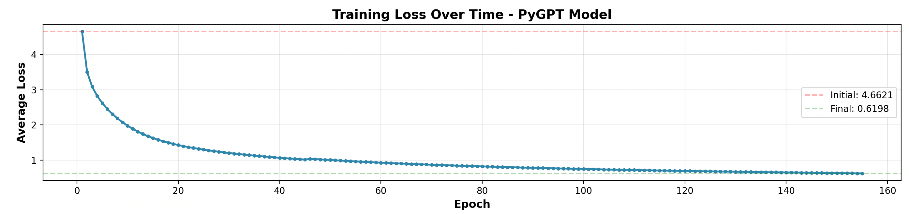
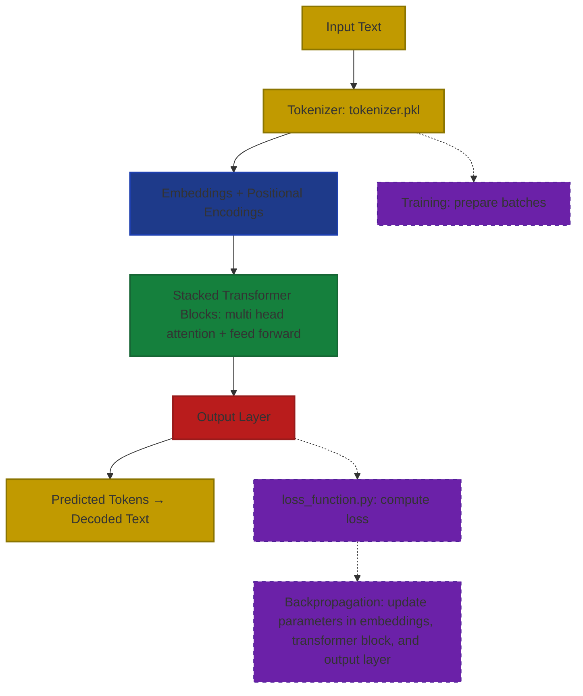

<p align="center">
  
  
  
  
</p>


# νοῦς (nous) — A Learning LLM Project

<div style="position: relative; width: 100%; height: 600px; margin: 40px 0;">
  
  
</div>

## Overview
νοῦς (nous, Greek for "mind/intellect") is a GPT-like LLM that uses a plethora of sources that are visible in the dataset loader.

But what **makes this different?**

Well, up to date, I haven't yet found a model for which I can customize literally anything with ease. Every GitHub repo that I've seen requires you to go into the depths of the model to look for `num_heads` or `embedding_dim` and read the entire 6.7k line readme file (sorta like this one).

My point is that this app, νοῦς, allows you to do exactly that: configure literally any part of the model with ease through an Electron app. This means that you can use:
- Custom datasets
- Custom tokenizers (I have a BPE Tokenizer class that you can use, but it's kinda slow, so I also use TikToken)
- Custom number of attention heads, stacks, embedding dimension, max sequence length, epochs, batch size, learning rate, warmup steps
- Basically anything you can think of you can change (except for the FFN Hidden layer, that's hardcoded to `4*embedding_dim`)

## Quickstart
1. Download the νοῦς app
   1. Either from GitHub
   2. Or:
```bash
git clone https://github.com/Albertlungu/Nous.git
cd Nous
npm run build:mac
```
2. Now that the app is saved on your computer, it is fully self contained, meaning you can move it in and out of directories with ease.
3. Open the app.
Enjoy!

>[!NOTE]
>If there's errors with the downloaded .app file, please feel free to contact me, I am open to comments and improvements.
>But momentarily, just follow the instructions on launching the electron app manually, which I have also placed below:
```bash
git clone https://github.com/Albertlungu/Nous.git
cd Nous
./metal_setup.sh
```
In one terminal window, run:
```bash
python api/server.py
```
Then in another:
```bash
cd electron-app
npm start
```

**To see more details, visit the user guide below.**

>[!NOTE]
> If you see some errors in the console (text in red), just quit the app with CMD+Q then reopen it. This usually fixes the issues.
> Don't worry about error (400 BAD REQUEST), that won't go away, it still works.

Some example prompts you can give it to see exactly how intelligent it is:
> Explain what a neural network is.
>
> Explain what photosynthesis is.

## User guide:
PyGPT already comes pre-installed with two models, `epoch155.pkl`, which just exists to have a backup, and `model.pkl`. Both of these can be found by right clicking the app and selecting `"Show Package Contents"`, then visiting `contents/resources/artifacts/models`. They have been trained for 155 total epochs, with a final loss of ~0.6

It is 77M parameters, which you will be able to see in the app.

To use the app for **generation**:
1. Navigate to the sidebar
2. Click on `Model Config`
3. Click on `Load Model`
4. Select a model of your choice
5. Wait for it to load
6. Go back to `Chat`, and ask away!

> [!NOTE]
> You can change inference config, such as max token length, temperature, and top_k to match what you want.

To use the app for **training**:
1. Go to `Datasets`
2. Click on `List Datasets` to see all available datasets. If there are none, use `Create Dataset`
   1. See more details on dataset usage below
3. Go to `Training`
4. Select whatever preferences you want
5. Click on `Save Config`
6. Press `Start Training`
7. Sit back, take some raw popcorn kernels, put them in a pan, and put the pan on your PC. In about 5 minutes, you'll have a lovely snack and a discombobulated computer. ❤️

To create a **dataset**, you can either:

a) Select a preset dataset, such as Alpaca, FLAN, and more
b) Use a dataset of your choice from HuggingFace
c) Import a dataset from your local drive (.txt or .pkl)

### Use the create datasets function
To import a dataset from HuggingFace, you must first go to their web interface, look for the dataset you wish to use, and click `Use this dataset`. This will open a dropdown menu. Select `Datasets`. From the code it gives you, which will look something like:

```python
from datasets import load_dataset

ds = load_dataset("Anthropic/AnthropicInterviewer")
```

You must copy the part inside quotations (here `Anthropic/AnthropicInterviewer`), and be sure to exclude the quotations.

Then, type the split you want to use (probably going to be `train`). Keep in mind, the current code does not have the ability to have a testing dataset to check overfitting.

Next, select the number of examples you want to use, and leave empty for 0 examples.

Now, you must select the format in which the dataset is made. Most instruction/response based datasets on HuggingFace have columns with an instruction, the context given for the instruction, and the response or output. The column titles are different from most datasets. Because of this, you have to change what is in curly braces, e.g., `{instruction}`, to the column title for each field.
  Optionally, you can also customize the label that shows up before the instruction, context, or response.

Finally, you get to choose the name of the text file it gets outputted to!

## Quickstart (CLI)
### If on MacOS (METAL):
```bash
git clone https://github.com/Albertlungu/Nous.git
cd Nous
./metal_setup.sh
```
### If on CUDA-enabled GPU:
```bash
git clone https://github.com/Albertlungu/Nous.git
cd Nous
./cuda_setup.sh
```

Ngl if ur not on either of these ur lowkey cooked for training. Generation should still work fine on CPU, but it might be a lil slow.

### To use Electron app locally (not downloaded app, just electron):
**Good news:** this will be exported as an executable for MacOS
**Bad news:** the file will be .app, most likely, and .exe will come out later, cause I don't have access to a windows PC.

Once you have run one of the two setup scripts, you must then run:
```bash
chmod +x start_app.sh
./start_app.sh
```

Yeah, I know, it's complicated. Baffling...

### Using the program with the CLI (Not Recommended - Use Electron):
To use this program, assuming all earlier steps have been completed:
```bash
python src/main.py
```

Then, follow the instructions given to you in the command line. It should look like this once the code is run:
```markdown
Hello World - Starting PyGPT

To train the model from scratch, please enter 't'
To extend from a previous checkpoint, please enter 'e'
To use the main function, where the model responds to model inputs that it should know how to answer, please enter 'm'
To analyze the current model, please enter 'a'
Or, to enter your own user input, please enter 'i':
```


## Libraries used
- numpy
- JAX-metal (made to run on mac)
  - Or JAX (CUDA)
- pickle
- sys
- os
- matplotlib

## The current model
The current fully trained model (which is kind of stupid) can be found in `artifacts/models/epoch155.pkl`. Its stats are as follows:

**Datasets used:**
- Alpaca dataset: 51,974 examples (20MB, 284,280 lines)
- WizardLM dataset: 70,004 examples (126MB, 1,537,373 lines)
- FLAN 50K dataset: 50,000 examples (87MB, 1,962,003 lines)
- GPT Teacher Dataset: 89,260 examples (55MB, 534,010 lines)
> 39 657 127 total tokens
>
> 88.4 average tokens per example
>
> Token range: 2 - 4,317 tokens
>
> Total text size: 2,701,520 lines
>
> Text format: Instruction-Input-Output triplets

**Model architecture**:

*Total parameters*: ~ 77 million (76,895,360)
  - Embedding Layer:     25,886,720 parameters
  - Attention Layers:    8,388,608 parameters
  - FeedForward Layers:  16,797,696 parameters
  - Layer Normalization: 16,384 parameters
  - Output Layer:        25,805,952 parameters

*Configuration:*
  - Vocabulary Size:           50,304 (TikToken tokenizer)
  - Embedding Dimension:       512
  - Number of Blocks:          8
  - Number of Attention Heads: 8
  - Max Sequence Length:       256
  - FFN Hidden Dimension:      2,048

**Training config:**
- Total number of epochs: 155 (loss 4.66 -> 0.62)
  - First train run:    45 epochs (loss 4.66 -> 1.01)
  - First extend run:   50 epochs (loss 1.01 -> 0.76)
  - Second extend run:  25 epochs (loss 0.76 -> 0.69)
  - Third extend run:   35 epochs (loss 0.69 -> 0.62)

File Path: PyGPT/artifacts/models/model.pkl
File Size: 881 MB (full checkpoint with optimizer state)
Model Size (float16): ~146.67 MB (weights only)
Format: Pickle (.pkl)
Last Modified: December 6, 2025 23:48

**Loss curve:**


**Example outputs at this stage:**
```
============================================================
Prompt: Instruction: List three best practices for starting a conversation.
Input:
Output:
============================================================

1. Set realistic goals and break tasks according to the parkedins.
2. Take care of your distractions and set achievable goals.
3. Offer work-life balance that are more productive when needed.
4. stumbled on more their own time using documents such as meal or a homes, and take advantage of the solutions to your learning process.
============================================================
Prompt: Instruction: Describe an interesting article you read recently.
Input:
Output:
============================================================
 One interesting blog about the importance of digital marketing is a successful audience of rising sales and increasing delivery. With a variety of products, products and services, there are an effective way to build a business. Getty 87 is a good source of industry and a potential campaigns to carry out significant issues, and can be the case as well as the current, a potential advocate for access to digital media, a potential industry that can be supported through online marketing and advertising campaigns.
```

## Installation and Setup (MacOS METAL)
This program requires the use of older Python releases, most notably 3.10.x. To do this, I recommend using PyEnv. The instructions for this are given below. Or, you could simply use the `./metal_setup.sh` file after cloning.

```bash
git clone JAX https://github.com/Albertlungu/PyGPT.git
```

**Install pyenv on your computer and verify installation**
```bash
curl https://pyenv.run | bash
pyenv --version
```
**Install python 3.10**
```bash
pyenv install 3.10 # This will install python 3.10.19 by default
pyenv local 3.10
```

### Setup pyenv shell
```bash
pyenv init # This shows an overview of how to setup shell, but will be covered in this readme
```
Run this to add the setup code to both `~/.zshrc` and `~/.zprofile`
```bash
cat << 'EOF' >> ~/.zshrc
export PYENV_ROOT="$HOME/.pyenv"
[[ -d $PYENV_ROOT/bin ]] && export PATH="$PYENV_ROOT/bin:$PATH"
eval "$(pyenv init - zsh)"
EOF

cat << 'EOF' >> ~/.zprofile
export PYENV_ROOT="$HOME/.pyenv"
[[ -d $PYENV_ROOT/bin ]] && export PATH="$PYENV_ROOT/bin:$PATH"
eval "$(pyenv init - zsh)"
EOF
```

Use shell and verify python version
```bash
pyenv shell 3.10
python --version # This should return "Python 3.10.19"
```

Once you have verified the use of Python 3.10, you can install the requirements and dependencies in a virtual environment.
```bash
python -m venv venv # Creates a virtual environment named 'venv'
source venv/bin/activate
which python # Should return "/Users/[your_user]/[something]/PyGPT/venv/bin/python.
```

*If `which python` does not return your venv path, make sure to manually change the path to your python interpreter in your IDE*
___

**Install dependencies**
```bash
pip install -r requirements.txt
```

## Installation and Setup (Cuda-enabled GPU)

Either run the `./cuda_setup.sh` file, or:

```bash
git clone "https://github.com/Albertlungu/PyGPT.git" #Clone the github repository
cd PyGPT
```

To see your cuda version:
```bash
nvidia-smi
```
Install the jax version that has your version of cuda enabled. You will see this version in the top right corner once you run the above command.

Start virtual environment
```bash
python3 -m venv venv
source venv/bin/activate
pip install -r cuda-requirements.txt # If your cuda version is different than 12.x, modify the gpu-requirements file to reflect that
```

**Upon runtime**, you may receive an error saying:
```bash
RuntimeError: Unable to load cuSPARSE. Is it installed?
```
And then telling you that it will run on CPU rather than GPU.

To fix, run:
```bash
unset LD_LIBRARY_PATH
```


## Data used in tokenizer and model

The data that I have decided to use to train both this model and the tokenizer it uses comes from the HuggingFace database. It is the Dolly-15k dataset, since it offers both good instruction-response format, as well as a strong foundation for general knowledge.

The training data file is not directly included in the GitHub repo due to size issues. The dataset setup takes around 20s. 

After installing `requirements.txt`, run `src/main/data_loader.py` with:
```bash
cd PyGPT # Make sure you are in the root directory.
python src/main/data_loader.py # Does not require "python3" since we are on Python 3.10.19
```

Remember, the tokenizer is trained on the specific Dolly-15k dataset. If you would like to use a different dataset, follow the tokenizer guide below.

For your own ease of use, I have included `src/utils/generate_synthetic_math_latex.py`, which can be used to make a dataset for understanding and interpreting math and LaTeX syntax. This, mixed with other databases from HuggingFace, can result in a specialized model.

## How to train tokenizer on your own dataset
To train the tokenizer on your own dataset, you first want to make sure it is cleaned of "Instructions", or "Responses", or anything of the sort. This is so that the model doesn't get confused by that noise.

Before training, load your dataset into a .txt file, and take a look at the format. If it has any of these labels, follow the code for the labels already covered in `clean_text` (lines 281 to 307):

```python
def clean_text(file_path):
    """
    Read dataset and strip out labels.
    Returns clean text with only the actual content.
    """
    clean_text = []

    with open(file_path, "r", encoding="utf-8") as f:
        for line in f:
            line = line.strip()
            # Remove the labels
            if line.startswith("Instruction:"):
                line = line.replace("Instruction:", "").strip()
            elif line.startswith("Input:"):
                line = line.replace("Input:", "").strip()
            elif line.startswith("Output:"):
                line = line.replace("Output:", "").strip()
            elif line.startswith("Response:"):
                line = line.replace("Response:", "").strip()
            elif line.startswith("Context:"):
                line = line.replace("Context:", "").strip()

            # Keep the line if it has content
            if line:
                clean_text.append(line)

    return " ".join(clean_text)
```

To make your own "flag" simply copy paste this block:
```python
elif line.startswith("Input:"):
  line = line.replace("Input:", "").strip()
```
And replace `"Input"` with the label that you would like to flag, both in the `elif` statement and in the `.replace()` parameter. The rest stays the same.

**Next**, you run the `main()` function to actually tokenize.

**Finally**, you have to run the `tokenize_training_data(path)` function to pre-tokenize the your training data. This is so that the model doesn't have to do this itself during training, which will save some time. 

>_Side note_, expect training data to take a while, especially with a large dataset. Currently, The device used is an M4 MacBook Air, and for a vocab size of 32k and a training sample of 145k lines, it is taking ~5hrs.

## Tokenizer Details
- Implements **Byte Pair Encoding (BPE)** algorithm to compress all words into subword tokens.
- Starts with a base vocab size of 256
- Iteratively merges the most frequent adjacent byte pairs (letter or character pairs) until max vocab size is reached

To learn more about BPE, I highly recommend [this video by Andrej Karpathy](https://www.youtube.com/watch?v=zduSFxRajkE) 
- **MASSIVE** thanks to him for his amazing instructional videos.

#### Example Usage:
```python
with open("artifacts/tokenizer.pkl", "rb") as f:
  tokenizer = pickle.load(f)
  tokenizer._ensure_vocab()

text = "hello world"
token_ids = tokenizer.encode(text)
print(token_ids)  # e.g., [104, 101, 108, 108, 111, 32, 119, 111, 114, 108, 100]

decoded_text = tokenizer.decode(token_ids)
print(decoded_text)  # "hello world"
```

#### Example of how it works (from [Wikipedia.org](https://en.wikipedia.org/wiki/Byte-pair_encoding#:~:text=The%20original%20BPE%20algorithm%20operates,the%20target%20text%20effectively%20compressed)):

Suppose the data to be encoded is:
```
aaabdaaabac
```
  The byte pair "aa" occurs most often, so it will be replaced by a byte that is not used in the data, such as "Z". Now there is the following data and replacement table:

```
ZabdZabac
Z=aa
```
  Then the process is repeated with byte pair "ab", replacing it with "Y":

```
ZYdZYac
Y=ab
Z=aa
```
  The only literal byte pair left occurs only once, and the encoding might stop here. Alternatively, the process could continue with recursive byte-pair encoding, replacing "ZY" with "X":

```
XdXac
X=ZY
Y=ab
Z=aa
```
  This data cannot be compressed further by byte-pair encoding because there are no pairs of bytes that occur more than once.

To decompress the data, simply perform the replacements in the reverse order.

**Source**: [Wikipedia](https://en.wikipedia.org/wiki/Byte-pair_encoding#:~:text=The%20original%20BPE%20algorithm%20operates,the%20target%20text%20effectively%20compressed)

## Other tokenizer option
You could, alternatively, use the tokenizer from OpenAI's TikToken library, which I also support. To do this, simply uncomment this in main.py:
```python
Load tokenizer - using TikToken
tokenizer = TikToken()
print(f"Loaded TikToken tokenizer with vocab size: {tokenizer.vocab_size}")
```

And comment out:
```python
with open("artifacts/tokenizer/tokenizer_alpaca.pkl", "rb") as f:
    tokenizer = pickle.load(f)
    tokenizer._ensure_vocab()
```

This might be biased, but I still recommend using my own tokenizer, since it is trained specifically on the dataset used (alpaca), and is what the code was optimized for. You may run into errors while using TikToken.

## Embeddings
My file for the embeddings can be found in `src/embeddings/embeddings.py`. I have a more comprehensive markdown file on how my embeddings work, so you can check that out at `concepts/positional_encoding.md`. However, this section will give a *higher level* overview on embeddings in general and positional encoding.

### What are embeddings?
___
In simple terms, embeddings are vector quantities that are attributed to each token id, giving every single token a numerical representation. We have to represent tokens and words in the english language through numbers because that's what computers understand. 
>For example, if I tell a normal computer, in plain english: "Eating is the action of putting (food) into the mouth and chewing and swallowing it," the computer will just yell at me for using incorrect syntax. If I tell it: "`eating = [0.01, -1.02, -3.5e-4, ..., 6e7, -9e-2]`, it will understand!

### But how does my code do it?
___

In my `__init__` method of `embeddings.py`, the most relevant attribute there is the following:
```python
self.key = jax.random.PRNGKey(0)
self.embeddings = jax.random.normal(self.key, (self.vocab_size, self.embedding_dim)) * jnp.sqrt(1.0/self.vocab_size)
```

Here, `key` is effectively JAX's overly complicated way to do NumPy's `np.random.randn`. It creates a random floating point number.
In the next line, I declare embeddings as being a random selection of floating point numbers. The reason I do this is so that my model has a starting point. It does not start with the training and then make the embeddings from there, but the opposite.
- First, I generate a matrix (called embedding matrix) of shape (vocab_size, embedding_dim) full of embeddings. Each of my embeddings contain `embedding_dim` numbers inside of them.
> For example, if I have `embedding_dim = 256` and `vocab_size = 32000`, I would have 32000 embeddings, each with 256 random numbers inside of it.
>
For the next step, we have to understand batching, and how it works.

_To note:_ a batch is a collection of sequences, used to make training faster and more efficient
A single batch of token IDs has a shape of `(batch_size, sequence_length a.k.a max_seq_len)`
> For example, if I have a batch size of 8, and a maximum sequence length of 512, my batch would have 8 sequences of 512 token IDs.
- Next, I feed this into my embedding matrix, and I look for the specific embedding of a token ID. This works because the embedding of a token of number "x" is simply the embedding at index "x", meaning:
```python
embedded = embeddings[token_ids]
```
- After I do this, I replace each token ID with its vector from the embedding matrix. This means that that specific token ID is no longer a simple number, such as "6741", but is now a vector quantity, such as `[0.01, -1.02, -3.5e-4, ..., 6e7, -9e-2]`
  - This produces a shape of (batch_size, max_seq_len, embedding_dim)
  - > Meaning: if I have the same parameters as before, my batch after embedding lookup would have 8 sequences of 512 tokens, where each token is represented by 256 numbers.

- Once that is done, I move on to the paddings. A padding token is a specific token ID that I choose, which is most often simply token 0. `pad_token_id = 0`. Padding tokens appear when sequences are different lengths, so that the batch is nice and rectangular. These tokens are then ignored by the model through an attention mask.
- > For example, if I had a sequence saying "I like to eat food", and another that said, "But I should really look into slimming down", and a third saying "But I love food too much, I cannot commit such a crime", assume the third string to have `seq_len=256`, the second string to have `seq_len=232` (just a random number, it doesn't matter), and the first string is of `seq_len=167` (again, random number). My model likes it when these sequences are all the same length, so that it doesn't put more weight and emphasis onto the longer one. So, what you do, is you add a bunch of padding ids to the shorter ones (assume `max_seq_len=256`) to make them 256 numbers.
- Finally, we move on to the "End of Sequence" id (EOS for short). This, unlike the padding id, should not be ignored by my model. The EOS token, while masked as to not affect weights and actual output, tells my model that the sequence is over, so it knows when a line ends, or when a sentence ends. The EOS token is usually set to the vocab size
  *- This is applied later in the transformer*
>> To see details on positional encoding, see `concepts/positional_encoding.md`

## Transformer
This project is based on a multi-head attention transformer architecture.
### What is the transformer architecture?
A transformer-based model is made up of either an encoder or decoder, or both. This model is based on the decoder architecture, mimicking ChatGPT. In the following graph, the encoder architecture is on the left, and the decoding architecture is on the right

This description will be focusing on the decoder architecture, since that is what is used in this model.

---
### Is Attention all You Need?
Using the famous paper from Google Mind, [Attention Is All You Need](https://arxiv.org/pdf/1706.03762), I have created an attention model in the ways which are described in this documentation.

This mode, as it currently stands, has architecture implemented for both single head and multi head attention. These can be explored in the files `src/transformer/single_head_attention.py` and `src/transformer/multi_head_attention.py` respectively. The single head attention is a remnant from the branch using NumPy, and does not use JAX or GPU-based processing.

Multi head attention, in the way I implemented it here, uses a set of four learnable parameters called **weights**. These include:
```python
self.W_Q = np.random.randn(self.embedding_dim, self.embedding_dim) * 0.01
self.W_K = np.random.randn(self.embedding_dim, self.embedding_dim) * 0.01
self.W_V = np.random.randn(self.embedding_dim, self.embedding_dim) * 0.01
self.W_O = np.random.randn(self.embedding_dim, self.embedding_dim) * 0.01
```
- `W_Q` represents **query weights**, which turns the user input into a "query" vector that represents what the current token wants to find. i.e., understands what the user is asking through learnable weights.
- `W_K` represents **key weights**, which represent the information that every token offers. They pull and transform the meaning from embeddings into a vector quantity.
  - You may be asking yourself *Wait, aren't embeddings already vectors? If so, then why do I need to transform them further into something the computer can understand?*
  - Well, they are transformed because, in multi-head attention, each head deals with a different part of the token's meaning, while the full embedding represents **everything** about the token itself.
- `W_V` represents **value weights**, transform token embeddings into value vectors. Values contain the information that will be used when a token is looked at. 
  - The **embedding** contains the complete definition of a token. **W_V** learns to extract aspects most useful for downstream processing. **Query and key weights** determine which tokens to attend to (attention scores), while value weights determine what information to retrieve from those tokens.
- Finally, `W_O` represents **output weights**, which are the final projection that comes after attention, where it's already combined information.
  - Output weights combine the information from all heads in order to pass this to the transformer block. 

All weights except for `W_O` each have shape `(embedding_dim, embedding_dim)`, which is more efficient than `(head_dim, head_dim)`
>> Again, just like any other learnable parameters, these keys are declared as random vector values, and modified later.

#### The forward method:
```python
Q = x @ params['W_Q']
K = x @ params['W_K']
V = x @ params["W_V"]
```

Here, I perform the linear transformation of the input into queries, keys, and values, here is the breakdown of the code and what it does:

- `x` is the input tensor with shape `(batch_size, seq_len, embedding_dim)` from the first transformer block.
- `params['W_Q']` is the query weight matrix, which is explained above (shape `(embedding_dim, embedding_dim`)
  - Params is a dictionary containing the weights declared in the `get_params_and_grads` function
- `@` is the matrix multiplication symbol
- `Q` is the output query tensor (jnp.jnparray) of shape `(batch_size, seq_len, embedding_dim)`

The same logic is true for the rest of the tensors (K and V)

**What is matrix mutliplication?**
Take 2 matrices, A and B:
- A has shape `(m x n)`
- B has shape `(n x p)`
- If `A[1]` ≠ `B[0]`, the matrix multiplication does not work

Each entry of the new matrix, C, is built by lining up the `i`-th row of A with the `j`-th column of B, mutliplying those numbers, and then summing them up. If you're a math person, the formula is below:

$$
C[i,j] = \sum_k{A[i, k] \cdot B[k, j]}
$$

Where:
- $i$ is the row index of A (therefore the row index of C), and $0 \leq i \leq m-1$
- $k$ is the column index of A and the row index of B, and $0 \leq k \leq n-1$
  - This dimension must match across both arrays (inner dimension)
- $j$ is the column index of B (therefore the column index of C), and $0 \leq j \leq p-1$

**For example:**

```math
A = \begin{bmatrix}
1 & 2 & 3 & 4\\
5 & 6 & 7 & 8 \\
9 & 10 & 11 & 12
\end{bmatrix}

B = \begin{bmatrix}
10 & 11 \\
20 & 21 \\
30 & 31 \\
40 & 41
\end{bmatrix}
```

These are denoted with:

```math
A \in \mathbb{Z}^{3x4}, \quad
B \in \mathbb{Z}^{4x2}
```

What happens under the hood here for `C[0,0]` ($k=4$):

$C=AB$ will have shape $3x2$, so the entry $C[0,0]$ is built by taking:
- row $0$ of $A:[1, 2, 3, 4]$
- column $0$ of $B:[10, 20, 30, 40]$ 
  
And applying dot product:

```math
C_{0,0} = \sum_{k=0}^3 A_{0,k} \cdot B_{k,0}
```

Expanding it term by term gives:

```math
C_{0,0} = A_{0,0}B_{0,0} + A_{0,1}B_{1,0} + A_{0,2}B_{0,2} + A_{0,3}B_{3,0} \\

\text{Plugging in the values: } C_{0,0} = (1)(10) + (2)(20) + (3)(30) + (4)(40) \\

C_{0,0} = 10 + 40 + 90 + 160 \\

C_{0,0} = 300
```

This pattern continues for all of the other indices of $C$

**Afterwards**, the weights are reshaped to be in accordance with the number of attention heads, using the `.reshape` method in Python, which simply rearranges the same elements into a different structure. 

When you reshape from `[batch, seq_len, embedding_dim]` to `[batch, num_heads, seq_len, embedding_dim // num_heads]`, you effectively create `num_heads` separate vectors for each token, and each vector is given to each head, where instead of for example, head 1, having to deal with all the floating point numbers inside of `embedding_dim`, it only has to deal with `embedding_dim // num_heads`, allowing for "specialization" of each head.


**For example**:
```python
# Original array: 1D with 12 elements
arr = jnp.array([1, 2, 3, 4, 5, 6, 7, 8, 9, 10, 11, 12])
# Shape: (12,)

# Reshape to 2D: 3 rows, 4 columns
arr_2d = arr.reshape(3, 4)
# Shape: (3, 4)
# [[1,  2,  3,  4],
#  [5,  6,  7,  8],
#  [9, 10, 11, 12]]

# Reshape to 3D: 2 × 2 × 3
arr_3d = arr.reshape(2, 2, 3)
# Shape: (2, 2, 3)
# [[[1,  2,  3],
#   [4,  5,  6]],
#  [[7,  8,  9],
#   [10, 11, 12]]]
```

**Next**, we transpose matrices to `[batch, num_heads, seq_len, head_dim]` to allow for the computation of scores later in:
```python
scores = Q @ K.transpose(0, 1, 3, 2) / jnp.sqrt(head_dim)
```
Which works because of matrix multiplication, which requires the last two dimensions of the first vector to be the same as the first two dimensions of the second vector:
- Last two dimensions: `[seq_len, head_dim]` - this is what each head operates on
- First two dimensions: `[batch, num_heads]` - these are just batched


#### The backward pass:
The backward pass is made with JAX's automatic gradient function, `jax.vjp`:

```python
params = self.get_params()
output, vjp_fn = jax.vjp(
    lambda p, x_: self.fwd(p, x_, self.num_heads, self.head_dim, self.embedding_dim), params, x)
grads_params, d_input = vjp_fn(d_output)
return grads_params, d_input
```

Here, we first get the parameters calculated from the forward pass using the `get_params()` method, which returns a dictionary:
```python
return {
    "W_Q": self.W_Q,
    "W_K": self.W_K,
    "W_V": self.W_V,
    "W_O": self.W_O
}
```

VJP stands for Vector-Jacobian Product, which is passed the fwd method of the MHA class, and automatically calculates gradients for backpropagation.

### Transformer Block and Stack:

The transformer block is like the glue that ties everything together. It is where the forward passes of the FFN and MHA layer are put together, and are used to get normalized and stable outputs.

#### What is layer normalization?
Layer normalization is used to ensure stable training by flattening every feature and taking away any excessively large number ranges. It makes it so that each of these features have mean 0 and variance 1.

> [!NOTE]
> ***Mean***: the average of all the numbers in the embedding:
>
> For a vector
>
> $$x = [x_1, x_2, ..., x_n]$$
>
> The formula becomes:
>
> $$\mu = \frac{1}{n}\sum_{i=1}^n x_i$$
>
> ***Variance***: measure of how spread out the numbers are from that same mean (range):
>
>$$\sigma^2=\frac{1}{n}\sum_{i=1}^n(x_i-\mu)^2$$
> Where:
> - $x_i$ is the *i-th* number in the vector $x$, also called the **feature**.
> - $n$ is the number of features in the vector, or in this case, `n = embedding_dim`
> - $\mu$ is the mean that was calculated using the earlier mathematical model.
>
> $(x_i - \mu)$ tells us how far each feature is from the mean, and it is squared so that positive and negative distances don't cancel out, but also so that big deviations become more important.
>
> Finally, it is divided by the $n$ to get the average of all the deviations

The next step in layer norm is the actual calculation using mean and variance:

$$
\hat{x} = \frac{x_i-\mu}{\sqrt{\sigma^2+\epsilon}}
$$

Here, we subtract the mean, $\mu$ from the original features, $x_i$, centering each feature around zero.

Then, we divide by the standard deviation, being $\sqrt{\sigma^2-\epsilon}$, where $\epsilon$ is a very small positive number added for numerical stability. This is so that if the variance $\sigma^2$ is very close to zero, we avoid division by zero error.

Finally, we apply $\gamma$ and $\beta$, being learnable parameters. `gamma`, $\gamma$, rescales the normalized value, while `beta`, $\beta$, shifts the normalized values. Think of them like the weights and biases in the FFN.

#### The Forward Pass:

Firstly, the fwd pass of the transformer block consists of two sublayers:
- LayerNorm → MultiHeadAttention
- LayerNorm → FeedForward Network

In the first sublayer, it sets a residual variable, defined by `residual_1 = x`, where `x` are the input embeddings, of shape [batch, seq_len, embedding_dim].

Then, `ln1_out` is declared, being defined as the first layer normalization, taking the parameters of `gamma1` and `beta1`.

## How PyGPT Works


